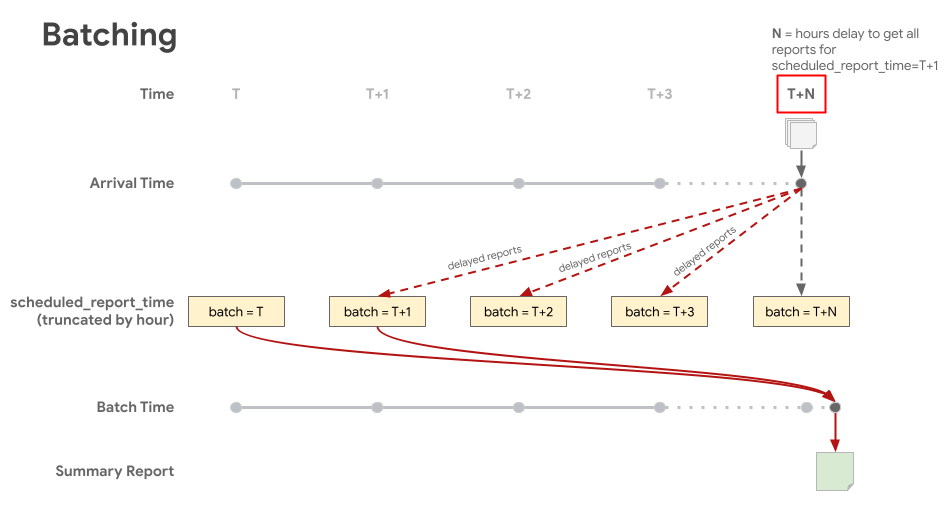
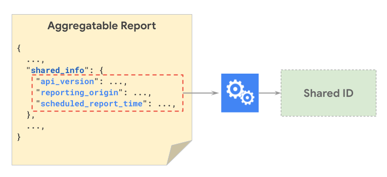
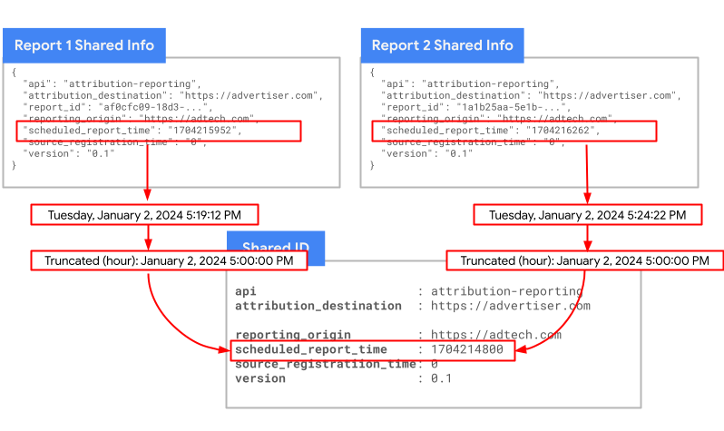
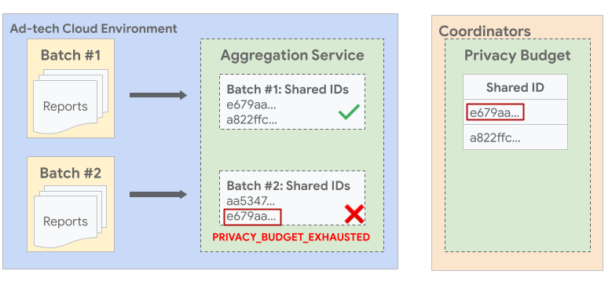

# Strategies for batching

When batching aggregatable reports, it is important to optimize batching strategies so that privacy
limits are not exceeded. The following are a few recommended strategies for sending batches of
reports to the Aggregation Service.

## Collect reports

When collecting reports to include in a batch, keep the following in mind:

#### Report upload retries

**Note:** Retry criteria are subject to change. The information in this section will be updated in
that case.

On both the web and OS platforms, a platform will attempt to send the report three times, but if the
report fails to be sent after the third try, it will not be sent. The original
`scheduled_report_time` value is preserved no matter when the report is able to be sent. The
timeline for retries is different per platform:

-   A web browser will send reports when the browser is online. If the report fails to send, it will
    wait five minutes for the second retry, and then 15 minutes for the third. If the browser goes
    offline, the next retry will be one minute after it comes back online. There is no maximum delay
    in sending reports on the web; this means, if the browser goes offline, no matter how long ago
    the report was generated, once the browser goes back online, it will try and send the report in
    accordance with the retry policy.
-   An Android phone has a consistent network connection. As such, it will run the job to send
    reports once per hour. This means that if a report fails to send, it will be retried the next
    hour, and again in the hour after that. If the device doesn't have a connection, the device will
    retry sending the report with the next reporting job that runs after the device connects to the
    network again. The maximum delay is 28 days, which means that the device will not send a report
    that was generated more than 28 days ago.

#### Wait on reports

It is recommended to wait for late arriving reports when collecting reports for batching. Late
reports can be determined by checking the `scheduled_report_time` value against when the report was
received. The time difference between those reports will help determine how long you may want to
consider waiting for late arriving reports. For example, as delayed reports are collected, check the
`scheduled_report_time` field and note the time delay in hours as 90%, 95%, and 99% of reports are
received. That data can be used to determine how long to wait for late arriving reports.
[Instant aggregate reports](https://github.com/WICG/attribution-reporting-api/blob/main/AGGREGATE.md#optional-reduce-report-delay-with-trigger-context-id)
can be used to reduce the chance of delayed reports.

The following visual shows late arriving reports being stored in the appropriate batches according
to scheduled report time. Batch T represents scheduled_report_time, and T+X represents time waited
for delayed reports. This results in a summary report that includes the majority of reports that are
included in the batch which corresponds to their scheduled report time.

### Aggregatable report accounting

The Aggregation Service maintains a
["no duplicates" rule](https://github.com/WICG/attribution-reporting-api/blob/main/AGGREGATION_SERVICE_TEE.md#no-duplicates-rule).
This rule enforces that all Aggregatable reports with the same shared ID must be included in the
same batch.

After the reports are collected, they should be batched in such a way that all reports with the same
shared ID are part of one batch.

If a report has already been processed in another batch, the processing can result in a
[privacy budget exhausted error](https://github.com/privacysandbox/aggregation-service/blob/2a83ed7c6e7c99d0a8fa4dc107edec86264aeaad/java/com/google/aggregate/adtech/worker/AggregationWorkerReturnCode.java#L26).
Batching reports correctly helps prevent batches from being rejected due to the "no duplicates"
rule.

A
[shared ID](https://github.com/WICG/attribution-reporting-api/blob/main/AGGREGATION_SERVICE_TEE.md#disjoint-batches)
is a key that is generated for each report to track aggregatable report accounting. The shared ID
ensures that reports with the same shared ID contribute to only one summary report. This means that
the reports that map to one shared ID together must all be included in a single batch. For example,
if Report X and Report Y both have the same shared ID, they must be included in the same batch to
avoid reports being dropped for duplication.

The following image demonstrates the shared_info components that are hashed together to generate a
Shared ID.

The following image demonstrates how two different reports can have the same shared ID:

**Note:** scheduled_report_time is truncated by hour, and source_registration_time is truncated by
day. Report_id is not used in shared ID creation. Time granularity may be updated in the future.

#### Duplicate reports within batches

The `shared_info` field in an aggregatable report contains a UUID in the `report_id` field, which is
used to identify duplicate reports within a batch. If there is more than one report with the same
`report_id` in a batch, only the first report will be aggregated, and the others will be considered
duplicates and silently dropped; the aggregation will proceed as normal and no errors will be sent.
Although not required, Adtech can expect to see some performance gains by filtering out the
duplicate reports with same reports ids before aggregation.

The `report_id` is unique to each report.

#### Duplicate reports across batches

Each report is assigned a shared ID, which is an ID generated from combined data points that come
from the report's `shared_info` field. Multiple reports can have the same shared ID, and each batch
can contain multiple shared IDs. All reports with the same shared ID must go in the same batch. If
reports with the same shared ID end up in multiple batches, only the first batch will be accepted,
and the others will be rejected as duplicates. To prevent this,
[batches must be created appropriately](#batch-reports).

The following image shows an example where reports with the same shared ID across batches can cause
the later batch to fail. In the image, you can see that two or more reports with the same shared ID
e679aa are batched into different batches #1 and #2. Since the budget for all reports with shared ID
e679aa is consumed during Batch #1 summary report generation, Batch #2 is not allowed and fails with
an error.

## Batch reports

The following are recommended ways to batch reports to avoid duplicates and optimize aggregate
report accounting.

### Batch by advertiser

**Note:** This strategy is only recommended for Attribution Reporting aggregation.

Private Aggregation does not have an attribution_destination field, which is the advertiser. It is
recommended to batch by advertiser, meaning to include reports belonging to a single advertiser in
the same batch, to avoid hitting the aggregatable report account limit for each batch. Advertiser is
a field considered in sharedID generation, so reports with the same advertiser could also have the
same sharedID, which would require them to be in the same batch to avoid errors.

### Batch by time

It is recommended to consider the report's scheduled report time
(`shared_info.scheduled_report_time`) when batching. Scheduled report time is truncated to the hour
in the shared ID generation, so at a minimum reports should be batched at hour intervals, meaning
all reports with scheduled report time within the same hour should go in the same batch to avoid
having reports with same shared ID across multiple batches, which will lead to job errors.

### Batching frequency and noise

It is recommended to consider the
[impact of noise](https://developers.google.com/privacy-sandbox/relevance/attribution-reporting/design-decisions#batching-frequency)
on how often aggregatable reports are processed. If aggregatable reports are batched more
frequently-for example, reports are processed once an hour-fewer conversion events will be included
and noise will have a larger relative impact. If the frequency is decreased and reports are
processed once a week, noise will have a smaller relative impact. To better understand the impact of
noise on batches, experiment with the [Noise Lab](https://noise-lab.uc.r.appspot.com/?mode=simple).
