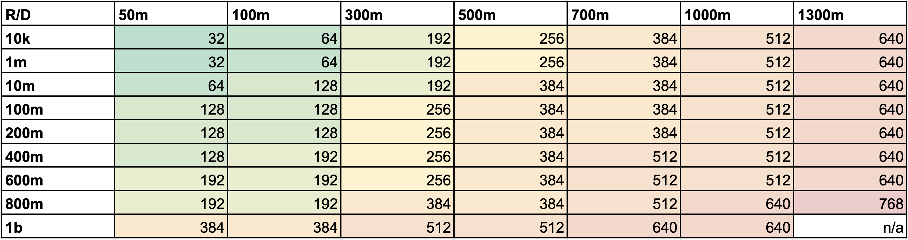

# Sizing Guidance for Aggregation Service

## Background

Adtechs use the aggregation service to generate summary reports from aggregatable reports (see the
[workflow](https://github.com/WICG/attribution-reporting-api/blob/main/AGGREGATION_SERVICE_TEE.md#aggregation-workflow)).
The aggregation service can process jobs of different input sizes (reports and pre-declared
aggregation buckets). Each report can include a different number of events. Each event is a
key-value pair in an aggregatable report's encrypted payload. A pre-declared aggregation bucket is
an entry (also referred to as domain key in this document) in the pre-declared buckets file that is
provided as an input in the aggregation job (see
[createJob API documentation](https://github.com/privacysandbox/aggregation-service/blob/main/docs/api.md#payload)).
Reports used in generating this guidance each have a payload with 10 events and were padded to the
report size of 20 (standard for
[Attribution Reporting API](https://github.com/WICG/attribution-reporting-api/blob/main/AGGREGATE.md#contribution-bounding-and-budgeting)
and
[Shared Storage](https://github.com/patcg-individual-drafts/private-aggregation-api?tab=readme-ov-file#limiting-the-number-of-contributions-per-report)).
Reports and domain keys are sharded into 1000 files individually when running the benchmark.

## Which Cloud compute instance type to use for aggregation?

The [table below](#minimum-workable-instance-with-memory) provides cloud instance type guidelines
for minimum required instance memory for aggregation jobs with different sizes of reports and
domains. For example, if your individual jobs are around the 10K reports/50 million domain size, an
instance type with at least 32 GB memory is required.

Note that this is a general guideline based on the input data as mentioned above and adtechs may use
a different instance type depending on their specific needs. For example, if an adtech wants lower
latency results, one may need to provision larger compute capacity instance types

After the instance type has been selected, the
[running times](#how-long-does-an-aggregation-job-take) provided below can be used to estimate the
cost per job and the total cost:

-   Cost per job = job running time \* cost of selected instance type
    ([AWS pricing](https://aws.amazon.com/ec2/pricing/on-demand/),
    [GCP pricing](https://cloud.google.com/compute/vm-instance-pricing))
-   Total estimated cost = # of jobs \* cost per job

Adtechs may use the formula above to determine the most cost-efficient machine for their jobs. For
example, an adTech chooses a r5.12xlarge instance for jobs with 1 million aggregatable reports and
200 million output domains. The running time for a job of this size is 1 hour per job:

-   Instance cost: $3.024 / hour
-   Cost per job = 1 hour \* $3.024 / hour = $3.024
-   Total cost = 10 jobs \* $3.024 / job = $30.24

The [table below](#minimum-workable-instance-with-memory) considers the following AWS and GCP
instances types:

-   [AWS](https://aws.amazon.com/ec2/instance-types/): m5.2xlarge (default), m5.4xlarge, m5.8xlarge,
    m5.12xlarge, r5.2xlarge, r5.4xlarge, r5.8xlarge, r5.12xlarge
-   [GCP](https://cloud.google.com/compute/docs/general-purpose-machines#n2-standard):
    n2d-standard-8 (default), n2d-standard-16, n2d-standard-32, n2d-standard-48, n2d-highmem-8,
    n2d-highmem-16, n2d-highmem-32, n2d-highmem-48, n2d-highmem-64, n2d-highmem-80, n2d-highmem-96

On AWS, if your jobs have larger domains (~1 billion keys), you may use the AWS machine type
x2iedn.8xlarge. For any other questions, please feel free to reach out to
[Aggregation Support](https://developers.google.com/privacy-sandbox/private-advertising/aggregation-service#engage_and_share_feedback).

For a given aggregation job, the rows (R) correspond to the input reports, the columns (D)
correspond to the domain keys (in millions), and the value is the minimum workable instance with
memory (GiB).

#### Minimum workable instance with memory

## How long does an aggregation job take?

The aggregation job completion time is the time an instance picks up the job from the job queue to
when the results were written to storage. The job completion time can be calculated from the fields
returned from the
[getJob](https://github.com/privacysandbox/aggregation-service/blob/86356cd5ac86aefc35ec62f82b154b1108e137a9/docs/api.md?plain=1#L267)
API using `request_updated_at` minus `request_processing_started_at` field. It depends on a number
of factors such as the size of the job inputs, the service instance compute capacity, the
auto-scaling size, and more.

The aggregation job completion times are split into different brackets. For example, the "00 hr 40
min" bracket indicates that the job ran for more than 20 minutes but less than or equal to 40
minutes. The "n/a" bracket indicates that the instance was not able to process the job, and a higher
capacity instance is needed.

The processing time values here are subject to change.

| Running time buckets |
| -------------------- |
| 00 hr 05 min         |
| 00 hr 20 min         |
| 00 hr 40 min         |
| 01 hr 00 min         |
| 02 hr 00 min         |
| 03 hr 00 min         |
| 04 hr 00 min         |
| 06 hr 00 min         |
| 10 hr 00 min         |
| 12 hr 00 min         |

In the following table, the rows (R) correspond to the input reports. The columns (D) correspond to
the domain keys (in millions).

-   Memory(GiB): 32 / vCPU: 8

| R/D  | 1m           | 50m          | 100m | 200m | 300m | 400m | 500m | 600m | 700m | 800m | 900m | 1000m | 1100m | 1200m | 1300m | 1400m | 1500m |
| ---- | ------------ | ------------ | ---- | ---- | ---- | ---- | ---- | ---- | ---- | ---- | ---- | ----- | ----- | ----- | ----- | ----- | ----- |
| 10k  | 00 hr 05 min | 00 hr 20 min | n/a  | n/a  | n/a  | n/a  | n/a  | n/a  | n/a  | n/a  | n/a  | n/a   | n/a   | n/a   | n/a   | n/a   | n/a   |
| 50k  | 00 hr 05 min | 00 hr 20 min | n/a  | n/a  | n/a  | n/a  | n/a  | n/a  | n/a  | n/a  | n/a  | n/a   | n/a   | n/a   | n/a   | n/a   | n/a   |
| 100k | 00 hr 05 min | 00 hr 20 min | n/a  | n/a  | n/a  | n/a  | n/a  | n/a  | n/a  | n/a  | n/a  | n/a   | n/a   | n/a   | n/a   | n/a   | n/a   |
| 1m   | 00 hr 05 min | 00 hr 20 min | n/a  | n/a  | n/a  | n/a  | n/a  | n/a  | n/a  | n/a  | n/a  | n/a   | n/a   | n/a   | n/a   | n/a   | n/a   |
| 10m  | 00 hr 40 min | n/a          | n/a  | n/a  | n/a  | n/a  | n/a  | n/a  | n/a  | n/a  | n/a  | n/a   | n/a   | n/a   | n/a   | n/a   | n/a   |
| 100m | n/a          | n/a          | n/a  | n/a  | n/a  | n/a  | n/a  | n/a  | n/a  | n/a  | n/a  | n/a   | n/a   | n/a   | n/a   | n/a   | n/a   |
| 200m | n/a          | n/a          | n/a  | n/a  | n/a  | n/a  | n/a  | n/a  | n/a  | n/a  | n/a  | n/a   | n/a   | n/a   | n/a   | n/a   | n/a   |
| 300m | n/a          | n/a          | n/a  | n/a  | n/a  | n/a  | n/a  | n/a  | n/a  | n/a  | n/a  | n/a   | n/a   | n/a   | n/a   | n/a   | n/a   |
| 400m | n/a          | n/a          | n/a  | n/a  | n/a  | n/a  | n/a  | n/a  | n/a  | n/a  | n/a  | n/a   | n/a   | n/a   | n/a   | n/a   | n/a   |
| 600m | n/a          | n/a          | n/a  | n/a  | n/a  | n/a  | n/a  | n/a  | n/a  | n/a  | n/a  | n/a   | n/a   | n/a   | n/a   | n/a   | n/a   |
| 700m | n/a          | n/a          | n/a  | n/a  | n/a  | n/a  | n/a  | n/a  | n/a  | n/a  | n/a  | n/a   | n/a   | n/a   | n/a   | n/a   | n/a   |
| 800m | n/a          | n/a          | n/a  | n/a  | n/a  | n/a  | n/a  | n/a  | n/a  | n/a  | n/a  | n/a   | n/a   | n/a   | n/a   | n/a   | n/a   |
| 1b   | n/a          | n/a          | n/a  | n/a  | n/a  | n/a  | n/a  | n/a  | n/a  | n/a  | n/a  | n/a   | n/a   | n/a   | n/a   | n/a   | n/a   |

-   Memory(GiB): 64 / vCPU: 8

| R/D  | 1m           | 50m          | 100m         | 200m | 300m | 400m | 500m | 600m | 700m | 800m | 900m | 1000m | 1100m | 1200m | 1300m | 1400m | 1500m |
| ---- | ------------ | ------------ | ------------ | ---- | ---- | ---- | ---- | ---- | ---- | ---- | ---- | ----- | ----- | ----- | ----- | ----- | ----- |
| 10k  | 00 hr 05 min | 00 hr 20 min | 00 hr 40 min | n/a  | n/a  | n/a  | n/a  | n/a  | n/a  | n/a  | n/a  | n/a   | n/a   | n/a   | n/a   | n/a   | n/a   |
| 50k  | 00 hr 05 min | 00 hr 20 min | 00 hr 40 min | n/a  | n/a  | n/a  | n/a  | n/a  | n/a  | n/a  | n/a  | n/a   | n/a   | n/a   | n/a   | n/a   | n/a   |
| 100k | 00 hr 05 min | 00 hr 20 min | 00 hr 40 min | n/a  | n/a  | n/a  | n/a  | n/a  | n/a  | n/a  | n/a  | n/a   | n/a   | n/a   | n/a   | n/a   | n/a   |
| 1m   | 00 hr 05 min | 00 hr 20 min | 00 hr 40 min | n/a  | n/a  | n/a  | n/a  | n/a  | n/a  | n/a  | n/a  | n/a   | n/a   | n/a   | n/a   | n/a   | n/a   |
| 10m  | 00 hr 40 min | 00 hr 40 min | n/a          | n/a  | n/a  | n/a  | n/a  | n/a  | n/a  | n/a  | n/a  | n/a   | n/a   | n/a   | n/a   | n/a   | n/a   |
| 100m | n/a          | n/a          | n/a          | n/a  | n/a  | n/a  | n/a  | n/a  | n/a  | n/a  | n/a  | n/a   | n/a   | n/a   | n/a   | n/a   | n/a   |
| 200m | n/a          | n/a          | n/a          | n/a  | n/a  | n/a  | n/a  | n/a  | n/a  | n/a  | n/a  | n/a   | n/a   | n/a   | n/a   | n/a   | n/a   |
| 300m | n/a          | n/a          | n/a          | n/a  | n/a  | n/a  | n/a  | n/a  | n/a  | n/a  | n/a  | n/a   | n/a   | n/a   | n/a   | n/a   | n/a   |
| 400m | n/a          | n/a          | n/a          | n/a  | n/a  | n/a  | n/a  | n/a  | n/a  | n/a  | n/a  | n/a   | n/a   | n/a   | n/a   | n/a   | n/a   |
| 600m | n/a          | n/a          | n/a          | n/a  | n/a  | n/a  | n/a  | n/a  | n/a  | n/a  | n/a  | n/a   | n/a   | n/a   | n/a   | n/a   | n/a   |
| 700m | n/a          | n/a          | n/a          | n/a  | n/a  | n/a  | n/a  | n/a  | n/a  | n/a  | n/a  | n/a   | n/a   | n/a   | n/a   | n/a   | n/a   |
| 800m | n/a          | n/a          | n/a          | n/a  | n/a  | n/a  | n/a  | n/a  | n/a  | n/a  | n/a  | n/a   | n/a   | n/a   | n/a   | n/a   | n/a   |
| 1b   | n/a          | n/a          | n/a          | n/a  | n/a  | n/a  | n/a  | n/a  | n/a  | n/a  | n/a  | n/a   | n/a   | n/a   | n/a   | n/a   | n/a   |

-   Memory(GiB):64 / vCPU: 16

| R/D  | 1m           | 50m          | 100m         | 200m | 300m | 400m | 500m | 600m | 700m | 800m | 900m | 1000m | 1100m | 1200m | 1300m | 1400m | 1500m |
| ---- | ------------ | ------------ | ------------ | ---- | ---- | ---- | ---- | ---- | ---- | ---- | ---- | ----- | ----- | ----- | ----- | ----- | ----- |
| 10k  | 00 hr 05 min | 00 hr 20 min | 00 hr 40 min | n/a  | n/a  | n/a  | n/a  | n/a  | n/a  | n/a  | n/a  | n/a   | n/a   | n/a   | n/a   | n/a   | n/a   |
| 50k  | 00 hr 05 min | 00 hr 20 min | 00 hr 40 min | n/a  | n/a  | n/a  | n/a  | n/a  | n/a  | n/a  | n/a  | n/a   | n/a   | n/a   | n/a   | n/a   | n/a   |
| 100k | 00 hr 05 min | 00 hr 20 min | 00 hr 40 min | n/a  | n/a  | n/a  | n/a  | n/a  | n/a  | n/a  | n/a  | n/a   | n/a   | n/a   | n/a   | n/a   | n/a   |
| 1m   | 00 hr 05 min | 00 hr 20 min | 00 hr 40 min | n/a  | n/a  | n/a  | n/a  | n/a  | n/a  | n/a  | n/a  | n/a   | n/a   | n/a   | n/a   | n/a   | n/a   |
| 10m  | 00 hr 20 min | 00 hr 40 min | n/a          | n/a  | n/a  | n/a  | n/a  | n/a  | n/a  | n/a  | n/a  | n/a   | n/a   | n/a   | n/a   | n/a   | n/a   |
| 100m | n/a          | n/a          | n/a          | n/a  | n/a  | n/a  | n/a  | n/a  | n/a  | n/a  | n/a  | n/a   | n/a   | n/a   | n/a   | n/a   | n/a   |
| 200m | n/a          | n/a          | n/a          | n/a  | n/a  | n/a  | n/a  | n/a  | n/a  | n/a  | n/a  | n/a   | n/a   | n/a   | n/a   | n/a   | n/a   |
| 300m | n/a          | n/a          | n/a          | n/a  | n/a  | n/a  | n/a  | n/a  | n/a  | n/a  | n/a  | n/a   | n/a   | n/a   | n/a   | n/a   | n/a   |
| 400m | n/a          | n/a          | n/a          | n/a  | n/a  | n/a  | n/a  | n/a  | n/a  | n/a  | n/a  | n/a   | n/a   | n/a   | n/a   | n/a   | n/a   |
| 600m | n/a          | n/a          | n/a          | n/a  | n/a  | n/a  | n/a  | n/a  | n/a  | n/a  | n/a  | n/a   | n/a   | n/a   | n/a   | n/a   | n/a   |
| 700m | n/a          | n/a          | n/a          | n/a  | n/a  | n/a  | n/a  | n/a  | n/a  | n/a  | n/a  | n/a   | n/a   | n/a   | n/a   | n/a   | n/a   |
| 800m | n/a          | n/a          | n/a          | n/a  | n/a  | n/a  | n/a  | n/a  | n/a  | n/a  | n/a  | n/a   | n/a   | n/a   | n/a   | n/a   | n/a   |
| 1b   | n/a          | n/a          | n/a          | n/a  | n/a  | n/a  | n/a  | n/a  | n/a  | n/a  | n/a  | n/a   | n/a   | n/a   | n/a   | n/a   | n/a   |

-   Memory(GiB): 128 / vCPU: 16

| R/D  | 1m           | 50m          | 100m         | 200m         | 300m | 400m | 500m | 600m | 700m | 800m | 900m | 1000m | 1100m | 1200m | 1300m | 1400m | 1500m |
| ---- | ------------ | ------------ | ------------ | ------------ | ---- | ---- | ---- | ---- | ---- | ---- | ---- | ----- | ----- | ----- | ----- | ----- | ----- |
| 10k  | 00 hr 05 min | 00 hr 20 min | 00 hr 40 min | 01 hr 00 min | n/a  | n/a  | n/a  | n/a  | n/a  | n/a  | n/a  | n/a   | n/a   | n/a   | n/a   | n/a   | n/a   |
| 50k  | 00 hr 05 min | 00 hr 20 min | 00 hr 40 min | 01 hr 00 min | n/a  | n/a  | n/a  | n/a  | n/a  | n/a  | n/a  | n/a   | n/a   | n/a   | n/a   | n/a   | n/a   |
| 100k | 00 hr 05 min | 00 hr 20 min | 00 hr 40 min | 01 hr 00 min | n/a  | n/a  | n/a  | n/a  | n/a  | n/a  | n/a  | n/a   | n/a   | n/a   | n/a   | n/a   | n/a   |
| 1m   | 00 hr 05 min | 00 hr 20 min | 00 hr 40 min | 01 hr 00 min | n/a  | n/a  | n/a  | n/a  | n/a  | n/a  | n/a  | n/a   | n/a   | n/a   | n/a   | n/a   | n/a   |
| 10m  | 00 hr 20 min | 00 hr 40 min | 00 hr 40 min | 02 hr 00 min | n/a  | n/a  | n/a  | n/a  | n/a  | n/a  | n/a  | n/a   | n/a   | n/a   | n/a   | n/a   | n/a   |
| 100m | 02 hr 00 min | 02 hr 00 min | 02 hr 00 min | n/a          | n/a  | n/a  | n/a  | n/a  | n/a  | n/a  | n/a  | n/a   | n/a   | n/a   | n/a   | n/a   | n/a   |
| 200m | 03 hr 00 min | 03 hr 00 min | 04 hr 00 min | n/a          | n/a  | n/a  | n/a  | n/a  | n/a  | n/a  | n/a  | n/a   | n/a   | n/a   | n/a   | n/a   | n/a   |
| 300m | 04 hr 00 min | 06 hr 00 min | 06 hr 00 min | n/a          | n/a  | n/a  | n/a  | n/a  | n/a  | n/a  | n/a  | n/a   | n/a   | n/a   | n/a   | n/a   | n/a   |
| 400m | 06 hr 00 min | 06 hr 00 min | n/a          | n/a          | n/a  | n/a  | n/a  | n/a  | n/a  | n/a  | n/a  | n/a   | n/a   | n/a   | n/a   | n/a   | n/a   |
| 600m | 10 hr 00 min | n/a          | n/a          | n/a          | n/a  | n/a  | n/a  | n/a  | n/a  | n/a  | n/a  | n/a   | n/a   | n/a   | n/a   | n/a   | n/a   |
| 700m | n/a          | n/a          | n/a          | n/a          | n/a  | n/a  | n/a  | n/a  | n/a  | n/a  | n/a  | n/a   | n/a   | n/a   | n/a   | n/a   | n/a   |
| 800m | n/a          | n/a          | n/a          | n/a          | n/a  | n/a  | n/a  | n/a  | n/a  | n/a  | n/a  | n/a   | n/a   | n/a   | n/a   | n/a   | n/a   |
| 1b   | n/a          | n/a          | n/a          | n/a          | n/a  | n/a  | n/a  | n/a  | n/a  | n/a  | n/a  | n/a   | n/a   | n/a   | n/a   | n/a   | n/a   |

-   Memory(GiB): 128 / vCPU: 32

| R/D  | 1m           | 50m          | 100m         | 200m         | 300m | 400m | 500m | 600m | 700m | 800m | 900m | 1000m | 1100m | 1200m | 1300m | 1400m | 1500m |
| ---- | ------------ | ------------ | ------------ | ------------ | ---- | ---- | ---- | ---- | ---- | ---- | ---- | ----- | ----- | ----- | ----- | ----- | ----- |
| 10k  | 00 hr 05 min | 00 hr 20 min | 00 hr 40 min | 01 hr 00 min | n/a  | n/a  | n/a  | n/a  | n/a  | n/a  | n/a  | n/a   | n/a   | n/a   | n/a   | n/a   | n/a   |
| 50k  | 00 hr 05 min | 00 hr 20 min | 00 hr 40 min | 01 hr 00 min | n/a  | n/a  | n/a  | n/a  | n/a  | n/a  | n/a  | n/a   | n/a   | n/a   | n/a   | n/a   | n/a   |
| 100k | 00 hr 05 min | 00 hr 20 min | 00 hr 40 min | 01 hr 00 min | n/a  | n/a  | n/a  | n/a  | n/a  | n/a  | n/a  | n/a   | n/a   | n/a   | n/a   | n/a   | n/a   |
| 1m   | 00 hr 05 min | 00 hr 20 min | 00 hr 40 min | 01 hr 00 min | n/a  | n/a  | n/a  | n/a  | n/a  | n/a  | n/a  | n/a   | n/a   | n/a   | n/a   | n/a   | n/a   |
| 10m  | 00 hr 20 min | 00 hr 20 min | 00 hr 40 min | n/a          | n/a  | n/a  | n/a  | n/a  | n/a  | n/a  | n/a  | n/a   | n/a   | n/a   | n/a   | n/a   | n/a   |
| 100m | 01 hr 00 min | 01 hr 00 min | 02 hr 00 min | n/a          | n/a  | n/a  | n/a  | n/a  | n/a  | n/a  | n/a  | n/a   | n/a   | n/a   | n/a   | n/a   | n/a   |
| 200m | 02 hr 00 min | 02 hr 00 min | 02 hr 00 min | n/a          | n/a  | n/a  | n/a  | n/a  | n/a  | n/a  | n/a  | n/a   | n/a   | n/a   | n/a   | n/a   | n/a   |
| 300m | 02 hr 00 min | 03 hr 00 min | n/a          | n/a          | n/a  | n/a  | n/a  | n/a  | n/a  | n/a  | n/a  | n/a   | n/a   | n/a   | n/a   | n/a   | n/a   |
| 400m | 03 hr 00 min | 03 hr 00 min | n/a          | n/a          | n/a  | n/a  | n/a  | n/a  | n/a  | n/a  | n/a  | n/a   | n/a   | n/a   | n/a   | n/a   | n/a   |
| 600m | 04 hr 00 min | n/a          | n/a          | n/a          | n/a  | n/a  | n/a  | n/a  | n/a  | n/a  | n/a  | n/a   | n/a   | n/a   | n/a   | n/a   | n/a   |
| 700m | n/a          | n/a          | n/a          | n/a          | n/a  | n/a  | n/a  | n/a  | n/a  | n/a  | n/a  | n/a   | n/a   | n/a   | n/a   | n/a   | n/a   |
| 800m | n/a          | n/a          | n/a          | n/a          | n/a  | n/a  | n/a  | n/a  | n/a  | n/a  | n/a  | n/a   | n/a   | n/a   | n/a   | n/a   | n/a   |
| 1b   | n/a          | n/a          | n/a          | n/a          | n/a  | n/a  | n/a  | n/a  | n/a  | n/a  | n/a  | n/a   | n/a   | n/a   | n/a   | n/a   | n/a   |

-   Memory(GiB): 256 / vCPU: 32

| R/D  | 1m           | 50m          | 100m         | 200m         | 300m         | 400m         | 500m         | 600m | 700m | 800m | 900m | 1000m | 1100m | 1200m | 1300m | 1400m | 1500m |
| ---- | ------------ | ------------ | ------------ | ------------ | ------------ | ------------ | ------------ | ---- | ---- | ---- | ---- | ----- | ----- | ----- | ----- | ----- | ----- |
| 10k  | 00 hr 05 min | 00 hr 20 min | 00 hr 40 min | 01 hr 00 min | 02 hr 00 min | 02 hr 00 min | 03 hr 00 min | n/a  | n/a  | n/a  | n/a  | n/a   | n/a   | n/a   | n/a   | n/a   | n/a   |
| 50k  | 00 hr 05 min | 00 hr 20 min | 00 hr 40 min | 01 hr 00 min | 02 hr 00 min | 02 hr 00 min | 03 hr 00 min | n/a  | n/a  | n/a  | n/a  | n/a   | n/a   | n/a   | n/a   | n/a   | n/a   |
| 100k | 00 hr 05 min | 00 hr 20 min | 00 hr 40 min | 01 hr 00 min | 02 hr 00 min | 02 hr 00 min | 03 hr 00 min | n/a  | n/a  | n/a  | n/a  | n/a   | n/a   | n/a   | n/a   | n/a   | n/a   |
| 1m   | 00 hr 05 min | 00 hr 20 min | 00 hr 40 min | 01 hr 00 min | 02 hr 00 min | 02 hr 00 min | 03 hr 00 min | n/a  | n/a  | n/a  | n/a  | n/a   | n/a   | n/a   | n/a   | n/a   | n/a   |
| 10m  | 00 hr 20 min | 00 hr 20 min | 00 hr 40 min | 01 hr 00 min | 02 hr 00 min | 02 hr 00 min | n/a          | n/a  | n/a  | n/a  | n/a  | n/a   | n/a   | n/a   | n/a   | n/a   | n/a   |
| 100m | 00 hr 40 min | 01 hr 00 min | 02 hr 00 min | 02 hr 00 min | 03 hr 00 min | 03 hr 00 min | n/a          | n/a  | n/a  | n/a  | n/a  | n/a   | n/a   | n/a   | n/a   | n/a   | n/a   |
| 200m | 02 hr 00 min | 02 hr 00 min | 02 hr 00 min | 02 hr 00 min | 03 hr 00 min | 03 hr 00 min | n/a          | n/a  | n/a  | n/a  | n/a  | n/a   | n/a   | n/a   | n/a   | n/a   | n/a   |
| 300m | 02 hr 00 min | 02 hr 00 min | 03 hr 00 min | 03 hr 00 min | 04 hr 00 min | n/a          | n/a          | n/a  | n/a  | n/a  | n/a  | n/a   | n/a   | n/a   | n/a   | n/a   | n/a   |
| 400m | 03 hr 00 min | 03 hr 00 min | 03 hr 00 min | 04 hr 00 min | 04 hr 00 min | n/a          | n/a          | n/a  | n/a  | n/a  | n/a  | n/a   | n/a   | n/a   | n/a   | n/a   | n/a   |
| 600m | 04 hr 00 min | 04 hr 00 min | 04 hr 00 min | 06 hr 00 min | 06 hr 00 min | n/a          | n/a          | n/a  | n/a  | n/a  | n/a  | n/a   | n/a   | n/a   | n/a   | n/a   | n/a   |
| 700m | 10 hr 00 min | 06 hr 00 min | 06 hr 00 min | 06 hr 00 min | 06 hr 00 min | n/a          | n/a          | n/a  | n/a  | n/a  | n/a  | n/a   | n/a   | n/a   | n/a   | n/a   | n/a   |
| 800m | 06 hr 00 min | 06 hr 00 min | 06 hr 00 min | 06 hr 00 min | n/a          | n/a          | n/a          | n/a  | n/a  | n/a  | n/a  | n/a   | n/a   | n/a   | n/a   | n/a   | n/a   |
| 1b   | 10 hr 00 min | n/a          | n/a          | n/a          | n/a          | n/a          | n/a          | n/a  | n/a  | n/a  | n/a  | n/a   | n/a   | n/a   | n/a   | n/a   | n/a   |

-   Memory(GiB): 256 / vCPU: 48

| R/D  | 1m           | 50m          | 100m         | 200m         | 300m         | 400m         | 500m | 600m | 700m | 800m | 900m | 1000m | 1100m | 1200m | 1300m | 1400m | 1500m |
| ---- | ------------ | ------------ | ------------ | ------------ | ------------ | ------------ | ---- | ---- | ---- | ---- | ---- | ----- | ----- | ----- | ----- | ----- | ----- |
| 10k  | 00 hr 05 min | 00 hr 20 min | 00 hr 40 min | 01 hr 00 min | 02 hr 00 min | 02 hr 00 min | n/a  | n/a  | n/a  | n/a  | n/a  | n/a   | n/a   | n/a   | n/a   | n/a   | n/a   |
| 50k  | 00 hr 05 min | 00 hr 20 min | 00 hr 40 min | 01 hr 00 min | 02 hr 00 min | 02 hr 00 min | n/a  | n/a  | n/a  | n/a  | n/a  | n/a   | n/a   | n/a   | n/a   | n/a   | n/a   |
| 100k | 00 hr 05 min | 00 hr 20 min | 00 hr 40 min | 01 hr 00 min | 02 hr 00 min | 02 hr 00 min | n/a  | n/a  | n/a  | n/a  | n/a  | n/a   | n/a   | n/a   | n/a   | n/a   | n/a   |
| 1m   | 00 hr 05 min | 00 hr 20 min | 00 hr 40 min | 01 hr 00 min | 02 hr 00 min | n/a          | n/a  | n/a  | n/a  | n/a  | n/a  | n/a   | n/a   | n/a   | n/a   | n/a   | n/a   |
| 10m  | 00 hr 20 min | 00 hr 20 min | 00 hr 40 min | 01 hr 00 min | 02 hr 00 min | n/a          | n/a  | n/a  | n/a  | n/a  | n/a  | n/a   | n/a   | n/a   | n/a   | n/a   | n/a   |
| 100m | 00 hr 40 min | 01 hr 00 min | 01 hr 00 min | 02 hr 00 min | n/a          | n/a          | n/a  | n/a  | n/a  | n/a  | n/a  | n/a   | n/a   | n/a   | n/a   | n/a   | n/a   |
| 200m | 01 hr 00 min | 02 hr 00 min | 02 hr 00 min | 02 hr 00 min | n/a          | n/a          | n/a  | n/a  | n/a  | n/a  | n/a  | n/a   | n/a   | n/a   | n/a   | n/a   | n/a   |
| 300m | 02 hr 00 min | 02 hr 00 min | 02 hr 00 min | 03 hr 00 min | n/a          | n/a          | n/a  | n/a  | n/a  | n/a  | n/a  | n/a   | n/a   | n/a   | n/a   | n/a   | n/a   |
| 400m | 02 hr 00 min | 02 hr 00 min | 03 hr 00 min | 03 hr 00 min | n/a          | n/a          | n/a  | n/a  | n/a  | n/a  | n/a  | n/a   | n/a   | n/a   | n/a   | n/a   | n/a   |
| 600m | 03 hr 00 min | 03 hr 00 min | 04 hr 00 min | n/a          | n/a          | n/a          | n/a  | n/a  | n/a  | n/a  | n/a  | n/a   | n/a   | n/a   | n/a   | n/a   | n/a   |
| 700m | 04 hr 00 min | 04 hr 00 min | 04 hr 00 min | n/a          | n/a          | n/a          | n/a  | n/a  | n/a  | n/a  | n/a  | n/a   | n/a   | n/a   | n/a   | n/a   | n/a   |
| 800m | 04 hr 00 min | 04 hr 00 min | 06 hr 00 min | n/a          | n/a          | n/a          | n/a  | n/a  | n/a  | n/a  | n/a  | n/a   | n/a   | n/a   | n/a   | n/a   | n/a   |
| 1b   | 06 hr 00 min | n/a          | n/a          | n/a          | n/a          | n/a          | n/a  | n/a  | n/a  | n/a  | n/a  | n/a   | n/a   | n/a   | n/a   | n/a   | n/a   |

-   Memory(GiB): 384 / vCPU: 48

| R/D  | 1m           | 50m          | 100m         | 200m         | 300m         | 400m         | 500m         | 600m         | 700m         | 800m         | 900m | 1000m | 1100m | 1200m | 1300m | 1400m | 1500m |
| ---- | ------------ | ------------ | ------------ | ------------ | ------------ | ------------ | ------------ | ------------ | ------------ | ------------ | ---- | ----- | ----- | ----- | ----- | ----- | ----- |
| 10k  | 00 hr 05 min | 00 hr 20 min | 00 hr 40 min | 01 hr 00 min | 02 hr 00 min | 02 hr 00 min | 03 hr 00 min | 03 hr 00 min | 04 hr 00 min | 04 hr 00 min | n/a  | n/a   | n/a   | n/a   | n/a   | n/a   | n/a   |
| 50k  | 00 hr 05 min | 00 hr 20 min | 00 hr 40 min | 01 hr 00 min | 02 hr 00 min | 02 hr 00 min | 03 hr 00 min | 03 hr 00 min | 04 hr 00 min | 04 hr 00 min | n/a  | n/a   | n/a   | n/a   | n/a   | n/a   | n/a   |
| 100k | 00 hr 05 min | 00 hr 20 min | 00 hr 40 min | 01 hr 00 min | 02 hr 00 min | 02 hr 00 min | 03 hr 00 min | 03 hr 00 min | 04 hr 00 min | 04 hr 00 min | n/a  | n/a   | n/a   | n/a   | n/a   | n/a   | n/a   |
| 1m   | 00 hr 05 min | 00 hr 20 min | 00 hr 40 min | 01 hr 00 min | 02 hr 00 min | 02 hr 00 min | 03 hr 00 min | 03 hr 00 min | 04 hr 00 min | 04 hr 00 min | n/a  | n/a   | n/a   | n/a   | n/a   | n/a   | n/a   |
| 10m  | 00 hr 20 min | 00 hr 20 min | 00 hr 40 min | 01 hr 00 min | 02 hr 00 min | 02 hr 00 min | 03 hr 00 min | 03 hr 00 min | 04 hr 00 min | n/a          | n/a  | n/a   | n/a   | n/a   | n/a   | n/a   | n/a   |
| 100m | 00 hr 40 min | 01 hr 00 min | 01 hr 00 min | 02 hr 00 min | 02 hr 00 min | 03 hr 00 min | 03 hr 00 min | 04 hr 00 min | 04 hr 00 min | n/a          | n/a  | n/a   | n/a   | n/a   | n/a   | n/a   | n/a   |
| 200m | 01 hr 00 min | 02 hr 00 min | 02 hr 00 min | 02 hr 00 min | 03 hr 00 min | 03 hr 00 min | 04 hr 00 min | 04 hr 00 min | 04 hr 00 min | n/a          | n/a  | n/a   | n/a   | n/a   | n/a   | n/a   | n/a   |
| 300m | 02 hr 00 min | 02 hr 00 min | 02 hr 00 min | 03 hr 00 min | 03 hr 00 min | 04 hr 00 min | 04 hr 00 min | 04 hr 00 min | n/a          | n/a          | n/a  | n/a   | n/a   | n/a   | n/a   | n/a   | n/a   |
| 400m | 02 hr 00 min | 02 hr 00 min | 03 hr 00 min | 03 hr 00 min | 03 hr 00 min | 04 hr 00 min | 04 hr 00 min | 06 hr 00 min | n/a          | n/a          | n/a  | n/a   | n/a   | n/a   | n/a   | n/a   | n/a   |
| 600m | 03 hr 00 min | 03 hr 00 min | 03 hr 00 min | 04 hr 00 min | 04 hr 00 min | 06 hr 00 min | 06 hr 00 min | n/a          | n/a          | n/a          | n/a  | n/a   | n/a   | n/a   | n/a   | n/a   | n/a   |
| 700m | 03 hr 00 min | 04 hr 00 min | 04 hr 00 min | 04 hr 00 min | 06 hr 00 min | 06 hr 00 min | 06 hr 00 min | n/a          | n/a          | n/a          | n/a  | n/a   | n/a   | n/a   | n/a   | n/a   | n/a   |
| 800m | 04 hr 00 min | 04 hr 00 min | 04 hr 00 min | 06 hr 00 min | 06 hr 00 min | 06 hr 00 min | 06 hr 00 min | n/a          | n/a          | n/a          | n/a  | n/a   | n/a   | n/a   | n/a   | n/a   | n/a   |
| 1b   | 06 hr 00 min | 06 hr 00 min | 06 hr 00 min | n/a          | n/a          | n/a          | n/a          | n/a          | n/a          | n/a          | n/a  | n/a   | n/a   | n/a   | n/a   | n/a   | n/a   |

-   Memory(GiB): 512 / vCPU: 64

| R/D  | 1m           | 50m          | 100m         | 200m         | 300m         | 400m         | 500m         | 600m         | 700m         | 800m         | 900m         | 1000m        | 1100m        | 1200m        | 1300m | 1400m | 1500m |
| ---- | ------------ | ------------ | ------------ | ------------ | ------------ | ------------ | ------------ | ------------ | ------------ | ------------ | ------------ | ------------ | ------------ | ------------ | ----- | ----- | ----- |
| 10k  | 00 hr 05 min | 00 hr 20 min | 00 hr 40 min | 01 hr 00 min | 02 hr 00 min | 02 hr 00 min | 02 hr 00 min | 03 hr 00 min | 03 hr 00 min | 03 hr 00 min | 06 hr 00 min | 06 hr 00 min | 06 hr 00 min | 06 hr 00 min | n/a   | n/a   | n/a   |
| 50k  | 00 hr 05 min | 00 hr 20 min | 00 hr 40 min | 01 hr 00 min | 02 hr 00 min | 02 hr 00 min | 02 hr 00 min | 03 hr 00 min | 04 hr 00 min | 04 hr 00 min | 06 hr 00 min | 06 hr 00 min | 06 hr 00 min | 06 hr 00 min | n/a   | n/a   | n/a   |
| 100k | 00 hr 05 min | 00 hr 20 min | 00 hr 40 min | 01 hr 00 min | 02 hr 00 min | 02 hr 00 min | 02 hr 00 min | 03 hr 00 min | 04 hr 00 min | 04 hr 00 min | 06 hr 00 min | 06 hr 00 min | 06 hr 00 min | 06 hr 00 min | n/a   | n/a   | n/a   |
| 1m   | 00 hr 05 min | 00 hr 20 min | 00 hr 40 min | 01 hr 00 min | 02 hr 00 min | 02 hr 00 min | 02 hr 00 min | 03 hr 00 min | 04 hr 00 min | 04 hr 00 min | 06 hr 00 min | 06 hr 00 min | 06 hr 00 min | 06 hr 00 min | n/a   | n/a   | n/a   |
| 10m  | 00 hr 05 min | 00 hr 20 min | 00 hr 40 min | 01 hr 00 min | 02 hr 00 min | 02 hr 00 min | 03 hr 00 min | 03 hr 00 min | 04 hr 00 min | 04 hr 00 min | 06 hr 00 min | 06 hr 00 min | 06 hr 00 min | n/a          | n/a   | n/a   | n/a   |
| 100m | 00 hr 40 min | 00 hr 40 min | 01 hr 00 min | 02 hr 00 min | 02 hr 00 min | 02 hr 00 min | 03 hr 00 min | 03 hr 00 min | 04 hr 00 min | 04 hr 00 min | 06 hr 00 min | 06 hr 00 min | 06 hr 00 min | n/a          | n/a   | n/a   | n/a   |
| 200m | 01 hr 00 min | 01 hr 00 min | 02 hr 00 min | 02 hr 00 min | 02 hr 00 min | 03 hr 00 min | 03 hr 00 min | 04 hr 00 min | 04 hr 00 min | 06 hr 00 min | 06 hr 00 min | 06 hr 00 min | 06 hr 00 min | n/a          | n/a   | n/a   | n/a   |
| 300m | 01 hr 00 min | 02 hr 00 min | 02 hr 00 min | 02 hr 00 min | 03 hr 00 min | 03 hr 00 min | 04 hr 00 min | 04 hr 00 min | 04 hr 00 min | 06 hr 00 min | 06 hr 00 min | 06 hr 00 min | n/a          | n/a          | n/a   | n/a   | n/a   |
| 400m | 02 hr 00 min | 02 hr 00 min | 02 hr 00 min | 02 hr 00 min | 03 hr 00 min | 03 hr 00 min | 04 hr 00 min | 06 hr 00 min | 04 hr 00 min | 06 hr 00 min | 06 hr 00 min | 06 hr 00 min | n/a          | n/a          | n/a   | n/a   | n/a   |
| 600m | 02 hr 00 min | 03 hr 00 min | 03 hr 00 min | 04 hr 00 min | 04 hr 00 min | 04 hr 00 min | 06 hr 00 min | 06 hr 00 min | 06 hr 00 min | 06 hr 00 min | 06 hr 00 min | 06 hr 00 min | n/a          | n/a          | n/a   | n/a   | n/a   |
| 700m | 03 hr 00 min | 03 hr 00 min | 03 hr 00 min | 03 hr 00 min | 04 hr 00 min | 04 hr 00 min | 06 hr 00 min | 06 hr 00 min | 06 hr 00 min | 06 hr 00 min | 10 hr 00 min | 10 hr 00 min | n/a          | n/a          | n/a   | n/a   | n/a   |
| 800m | 04 hr 00 min | 03 hr 00 min | 04 hr 00 min | 04 hr 00 min | 04 hr 00 min | 06 hr 00 min | 06 hr 00 min | 06 hr 00 min | 06 hr 00 min | 10 hr 00 min | 10 hr 00 min | n/a          | n/a          | n/a          | n/a   | n/a   | n/a   |
| 1b   | 04 hr 00 min | 04 hr 00 min | 04 hr 00 min | 06 hr 00 min | 06 hr 00 min | 06 hr 00 min | 06 hr 00 min | n/a          | n/a          | n/a          | n/a          | n/a          | n/a          | n/a          | n/a   | n/a   | n/a   |

-   Memory(GiB): 640 / vCPU: 80

| R/D  | 1m           | 50m          | 100m         | 200m         | 300m         | 400m         | 500m         | 600m         | 700m         | 800m         | 900m         | 1000m        | 1100m        | 1200m        | 1300m        | 1400m | 1500m |
| ---- | ------------ | ------------ | ------------ | ------------ | ------------ | ------------ | ------------ | ------------ | ------------ | ------------ | ------------ | ------------ | ------------ | ------------ | ------------ | ----- | ----- |
| 10k  | 00 hr 05 min | 00 hr 20 min | 00 hr 40 min | 01 hr 00 min | 02 hr 00 min | 02 hr 00 min | 03 hr 00 min | 03 hr 00 min | 04 hr 00 min | 06 hr 00 min | 04 hr 00 min | 06 hr 00 min | 06 hr 00 min | 10 hr 00 min | 10 hr 00 min | n/a   | n/a   |
| 50k  | 00 hr 05 min | 00 hr 20 min | 00 hr 40 min | 01 hr 00 min | 02 hr 00 min | 02 hr 00 min | 03 hr 00 min | 03 hr 00 min | 04 hr 00 min | 06 hr 00 min | 04 hr 00 min | 06 hr 00 min | 06 hr 00 min | 10 hr 00 min | 10 hr 00 min | n/a   | n/a   |
| 100k | 00 hr 05 min | 00 hr 20 min | 00 hr 40 min | 02 hr 00 min | 02 hr 00 min | 02 hr 00 min | 03 hr 00 min | 03 hr 00 min | 04 hr 00 min | 06 hr 00 min | 06 hr 00 min | 06 hr 00 min | 06 hr 00 min | 10 hr 00 min | 10 hr 00 min | n/a   | n/a   |
| 1m   | 00 hr 05 min | 00 hr 20 min | 00 hr 40 min | 01 hr 00 min | 02 hr 00 min | 02 hr 00 min | 03 hr 00 min | 03 hr 00 min | 04 hr 00 min | 06 hr 00 min | 06 hr 00 min | 06 hr 00 min | 06 hr 00 min | 10 hr 00 min | 10 hr 00 min | n/a   | n/a   |
| 10m  | 00 hr 05 min | 00 hr 40 min | 00 hr 40 min | 02 hr 00 min | 02 hr 00 min | 03 hr 00 min | 03 hr 00 min | 04 hr 00 min | 04 hr 00 min | 06 hr 00 min | 06 hr 00 min | 06 hr 00 min | 06 hr 00 min | 10 hr 00 min | 10 hr 00 min | n/a   | n/a   |
| 100m | 00 hr 40 min | 00 hr 40 min | 01 hr 00 min | 02 hr 00 min | 02 hr 00 min | 03 hr 00 min | 03 hr 00 min | 04 hr 00 min | 04 hr 00 min | 06 hr 00 min | 06 hr 00 min | 06 hr 00 min | 06 hr 00 min | 10 hr 00 min | 10 hr 00 min | n/a   | n/a   |
| 200m | 01 hr 00 min | 01 hr 00 min | 02 hr 00 min | 02 hr 00 min | 03 hr 00 min | 03 hr 00 min | 03 hr 00 min | 04 hr 00 min | 04 hr 00 min | 06 hr 00 min | 06 hr 00 min | 06 hr 00 min | 06 hr 00 min | 10 hr 00 min | 10 hr 00 min | n/a   | n/a   |
| 300m | 01 hr 00 min | 02 hr 00 min | 02 hr 00 min | 02 hr 00 min | 03 hr 00 min | 03 hr 00 min | 03 hr 00 min | 06 hr 00 min | 06 hr 00 min | 06 hr 00 min | 06 hr 00 min | 10 hr 00 min | 06 hr 00 min | 10 hr 00 min | 10 hr 00 min | n/a   | n/a   |
| 400m | 02 hr 00 min | 02 hr 00 min | 02 hr 00 min | 03 hr 00 min | 03 hr 00 min | 03 hr 00 min | 04 hr 00 min | 06 hr 00 min | 06 hr 00 min | 06 hr 00 min | 10 hr 00 min | 10 hr 00 min | 10 hr 00 min | 10 hr 00 min | 10 hr 00 min | n/a   | n/a   |
| 600m | 02 hr 00 min | 03 hr 00 min | 03 hr 00 min | 03 hr 00 min | 03 hr 00 min | 04 hr 00 min | 06 hr 00 min | 06 hr 00 min | 06 hr 00 min | 06 hr 00 min | 10 hr 00 min | 10 hr 00 min | 10 hr 00 min | 10 hr 00 min | 10 hr 00 min | n/a   | n/a   |
| 700m | 03 hr 00 min | 03 hr 00 min | 03 hr 00 min | 04 hr 00 min | 04 hr 00 min | 04 hr 00 min | 06 hr 00 min | 06 hr 00 min | 06 hr 00 min | 06 hr 00 min | 10 hr 00 min | 10 hr 00 min | 10 hr 00 min | 10 hr 00 min | 10 hr 00 min | n/a   | n/a   |
| 800m | 03 hr 00 min | 03 hr 00 min | 03 hr 00 min | 04 hr 00 min | 04 hr 00 min | 06 hr 00 min | 06 hr 00 min | 06 hr 00 min | 06 hr 00 min | 06 hr 00 min | 10 hr 00 min | 10 hr 00 min | 10 hr 00 min | 10 hr 00 min | n/a          | n/a   | n/a   |
| 1b   | 03 hr 00 min | 04 hr 00 min | 04 hr 00 min | 04 hr 00 min | 06 hr 00 min | 06 hr 00 min | 06 hr 00 min | 06 hr 00 min | 10 hr 00 min | 10 hr 00 min | 10 hr 00 min | 10 hr 00 min | 10 hr 00 min | 10 hr 00 min | n/a          | n/a   | n/a   |

-   Memory(GiB): 768 / vCPU: 96

| R/D  | 1m           | 50m          | 100m         | 200m         | 300m         | 400m         | 500m         | 600m         | 700m         | 800m         | 900m         | 1000m        | 1100m        | 1200m        | 1300m        | 1400m | 1500m |
| ---- | ------------ | ------------ | ------------ | ------------ | ------------ | ------------ | ------------ | ------------ | ------------ | ------------ | ------------ | ------------ | ------------ | ------------ | ------------ | ----- | ----- |
| 10k  | 00 hr 05 min | 00 hr 20 min | 00 hr 40 min | 02 hr 00 min | 02 hr 00 min | 03 hr 00 min | 03 hr 00 min | 04 hr 00 min | 04 hr 00 min | 04 hr 00 min | 04 hr 00 min | 04 hr 00 min | 06 hr 00 min | 06 hr 00 min | 10 hr 00 min | n/a   | n/a   |
| 50k  | 00 hr 05 min | 00 hr 20 min | 00 hr 40 min | 02 hr 00 min | 02 hr 00 min | 03 hr 00 min | 03 hr 00 min | 04 hr 00 min | 04 hr 00 min | 04 hr 00 min | 04 hr 00 min | 04 hr 00 min | 06 hr 00 min | 06 hr 00 min | 10 hr 00 min | n/a   | n/a   |
| 100k | 00 hr 05 min | 00 hr 20 min | 00 hr 40 min | 02 hr 00 min | 02 hr 00 min | 03 hr 00 min | 03 hr 00 min | 04 hr 00 min | 04 hr 00 min | 04 hr 00 min | 04 hr 00 min | 06 hr 00 min | 06 hr 00 min | 06 hr 00 min | 10 hr 00 min | n/a   | n/a   |
| 1m   | 00 hr 05 min | 00 hr 20 min | 00 hr 40 min | 02 hr 00 min | 02 hr 00 min | 03 hr 00 min | 03 hr 00 min | 04 hr 00 min | 04 hr 00 min | 04 hr 00 min | 04 hr 00 min | 06 hr 00 min | 06 hr 00 min | 06 hr 00 min | 10 hr 00 min | n/a   | n/a   |
| 10m  | 00 hr 05 min | 00 hr 40 min | 00 hr 40 min | 02 hr 00 min | 02 hr 00 min | 03 hr 00 min | 03 hr 00 min | 04 hr 00 min | 04 hr 00 min | 04 hr 00 min | 04 hr 00 min | 06 hr 00 min | 06 hr 00 min | 06 hr 00 min | 10 hr 00 min | n/a   | n/a   |
| 100m | 00 hr 40 min | 00 hr 40 min | 01 hr 00 min | 02 hr 00 min | 02 hr 00 min | 03 hr 00 min | 03 hr 00 min | 04 hr 00 min | 04 hr 00 min | 06 hr 00 min | 04 hr 00 min | 06 hr 00 min | 06 hr 00 min | 06 hr 00 min | 10 hr 00 min | n/a   | n/a   |
| 200m | 00 hr 40 min | 01 hr 00 min | 02 hr 00 min | 02 hr 00 min | 02 hr 00 min | 03 hr 00 min | 03 hr 00 min | 04 hr 00 min | 04 hr 00 min | 06 hr 00 min | 06 hr 00 min | 06 hr 00 min | 06 hr 00 min | 10 hr 00 min | 10 hr 00 min | n/a   | n/a   |
| 300m | 01 hr 00 min | 02 hr 00 min | 02 hr 00 min | 02 hr 00 min | 03 hr 00 min | 03 hr 00 min | 04 hr 00 min | 04 hr 00 min | 06 hr 00 min | 06 hr 00 min | 06 hr 00 min | 06 hr 00 min | 06 hr 00 min | 10 hr 00 min | 10 hr 00 min | n/a   | n/a   |
| 400m | 02 hr 00 min | 02 hr 00 min | 02 hr 00 min | 03 hr 00 min | 03 hr 00 min | 03 hr 00 min | 04 hr 00 min | 06 hr 00 min | 06 hr 00 min | 06 hr 00 min | 06 hr 00 min | 06 hr 00 min | 06 hr 00 min | 10 hr 00 min | 10 hr 00 min | n/a   | n/a   |
| 600m | 02 hr 00 min | 03 hr 00 min | 03 hr 00 min | 03 hr 00 min | 04 hr 00 min | 04 hr 00 min | 06 hr 00 min | 06 hr 00 min | 06 hr 00 min | 06 hr 00 min | 10 hr 00 min | 10 hr 00 min | 10 hr 00 min | 10 hr 00 min | 10 hr 00 min | n/a   | n/a   |
| 700m | 03 hr 00 min | 03 hr 00 min | 03 hr 00 min | 03 hr 00 min | 04 hr 00 min | 06 hr 00 min | 06 hr 00 min | 06 hr 00 min | 06 hr 00 min | 10 hr 00 min | 10 hr 00 min | 10 hr 00 min | 10 hr 00 min | 10 hr 00 min | 10 hr 00 min | n/a   | n/a   |
| 800m | 03 hr 00 min | 03 hr 00 min | 03 hr 00 min | 04 hr 00 min | 06 hr 00 min | 06 hr 00 min | 06 hr 00 min | 06 hr 00 min | 06 hr 00 min | 10 hr 00 min | 10 hr 00 min | 10 hr 00 min | 10 hr 00 min | 10 hr 00 min | 10 hr 00 min | n/a   | n/a   |
| 1b   | 04 hr 00 min | 04 hr 00 min | 04 hr 00 min | 04 hr 00 min | 06 hr 00 min | 06 hr 00 min | 06 hr 00 min | 06 hr 00 min | n/a          | n/a          | n/a          | n/a          | n/a          | n/a          | n/a          | n/a   | n/a   |
