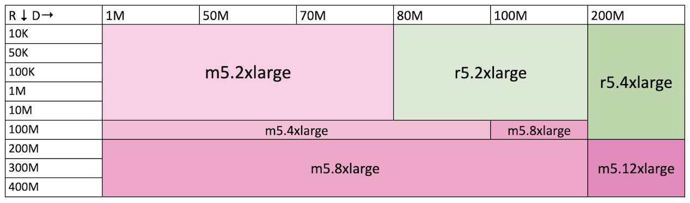

# Sizing Guidance for Aggregation Service on AWS

## Background

Ad techs use the aggregation service to generate summary reports from aggregatable reports (see the
[workflow](https://github.com/WICG/attribution-reporting-api/blob/main/AGGREGATION_SERVICE_TEE.md#aggregation-workflow)).
The aggregation service can process jobs of different input sizes (reports and pre-declared
aggregation buckets). Each report can include a different number of events. Each event is a
key-value pair in an aggregatable report's encrypted payload. A pre-declared aggregation bucket is
an entry (also referred to as domain key in this document) in the pre-declared buckets file that is
provided as an input in the aggregation job (see
[createJob API documentation](https://github.com/privacysandbox/aggregation-service/blob/main/docs/api.md#payload)).
Reports used in generating this guidance, each have a payload with 10 events.

## Which Cloud compute instance type to use for aggregation? -

The table below provides cloud instance type guidelines for cost-efficient processing of aggregation
jobs with different sizes of reports and domain. The recommendation is based on
[job processing time](#how-long-does-an-aggregation-job-take--) and estimated EC2 instance cost from
[Amazon EC2 Pricing](https://aws.amazon.com/ec2/pricing/on-demand/). For example, if your individual
jobs are below the 50K reports/50 million domain size, m5.2xlarge EC2 instance type is recommended.

Note that this is a general guideline, and ad techs may need to use a different instance type
depending on their specific needs. For example, if jobs need a tighter time-bound, one may need to
provision larger compute capacity instance types.

The table considers the following AWS EC2 instances types: m5.2xlarge (default), m5.4xlarge,
m5.8xlarge, m5.12xlarge, r5.2xlarge, r5.4xlarge, and r5.8xlarge.

For a given aggregation job, the rows (R) correspond to the input reports. The columns (D)
correspond to the domain keys (in millions).

The instance types here are subject to change.

## How long does an aggregation job take? -

The aggregation job completion time is the time an instance picks up the job from the job queue to
when the results were written to S3. It depends on a number of factors like the size of the job
inputs, the service instance compute capacity, the auto scaling size, and more.

The following tables show the approximate processing time bounds of jobs of varying size after a job
is picked up for processing by an aggregation worker. Each report includes 10 events and each event
is a key-value pair in the report's payload. The domain key is a bucket/key in the pre-declared
buckets file that is provided as an input parameter to the aggregation job.

The processing time of the jobs are split into different brackets. For example, the "00 hr 02 min"
bracket indicates that the job ran for more than 1 minute but less than or equal to 2 minutes. The
"n/a" bracket indicates that the instance was not able to process the job, and a higher capacity
instance is needed.

The processing time values here are subject to change.

| Running time buckets |
| -------------------- |
| 00 hr 01 min         |
| 00 hr 02 min         |
| 00 hr 10 min         |
| 00 hr 20 min         |
| 01 hr 00 min         |
| 02 hr 00 min         |
| 03 hr 00 min         |
| 04 hr 00 min         |
| 06 hr 00 min         |
| 10 hr 00 min         |

In the following table, the rows (R) correspond to the input reports. The columns (D) correspond to
the domain keys (in millions).

-   m5.2xlarge

| R / D | 1M           | 50M          | 70M          | 80M | 100M | 200M |
| ----- | ------------ | ------------ | ------------ | --- | ---- | ---- |
| 10K   | 00 hr 02 min | 00 hr 20 min | 00 hr 20 min | n/a | n/a  | n/a  |
| 50K   | 00 hr 02 min | 00 hr 20 min | 00 hr 20 min | n/a | n/a  | n/a  |
| 100K  | 00 hr 02 min | 00 hr 20 min | 00 hr 20 min | n/a | n/a  | n/a  |
| 1M    | 00 hr 02 min | 00 hr 20 min | 00 hr 20 min | n/a | n/a  | n/a  |
| 10M   | 00 hr 20 min | 01 hr 00 min | 01 hr 00 min | n/a | n/a  | n/a  |
| 100M  | 03 hr 00 min | 04 hr 00 min | n/a          | n/a | n/a  | n/a  |
| 200M  | 06 hr 00 min | n/a          | n/a          | n/a | n/a  | n/a  |
| 300M  | 10 hr 00 min | n/a          | n/a          | n/a | n/a  | n/a  |
| 400M  | n/a          | n/a          | n/a          | n/a | n/a  | n/a  |

-   m5.4xlarge

| R / D | 1M           | 50M          | 70M          | 80M          | 100M         | 200M |
| ----- | ------------ | ------------ | ------------ | ------------ | ------------ | ---- |
| 10K   | 00 hr 01 min | 00 hr 10 min | 00 hr 20 min | 00 hr 20 min | 00 hr 20 min | n/a  |
| 50K   | 00 hr 01 min | 00 hr 10 min | 00 hr 20 min | 00 hr 20 min | 00 hr 20 min | n/a  |
| 100K  | 00 hr 01 min | 00 hr 10 min | 00 hr 20 min | 00 hr 20 min | 00 hr 20 min | n/a  |
| 1M    | 00 hr 02 min | 00 hr 10 min | 00 hr 20 min | 00 hr 20 min | 00 hr 20 min | n/a  |
| 10M   | 00 hr 10 min | 00 hr 20 min | 00 hr 20 min | 00 hr 20 min | n/a          | n/a  |
| 100M  | 02 hr 00 min | 02 hr 00 min | 02 hr 00 min | 02 hr 00 min | n/a          | n/a  |
| 200M  | 02 hr 00 min | 03 hr 00 min | n/a          | n/a          | n/a          | n/a  |
| 300M  | 04 hr 00 min | n/a          | n/a          | n/a          | n/a          | n/a  |
| 400M  | 06 hr 00 min | n/a          | n/a          | n/a          | n/a          | n/a  |

-   m5.8xlarge

| R / D | 1M           | 50M          | 70M          | 80M          | 100M         | 200M         |
| ----- | ------------ | ------------ | ------------ | ------------ | ------------ | ------------ |
| 10K   | 00 hr 01 min | 00 hr 10 min | 00 hr 20 min | 00 hr 20 min | 00 hr 20 min | 01 hr 00 min |
| 50K   | 00 hr 01 min | 00 hr 10 min | 00 hr 20 min | 00 hr 20 min | 00 hr 20 min | 01 hr 00 min |
| 100K  | 00 hr 01 min | 00 hr 10 min | 00 hr 20 min | 00 hr 20 min | 00 hr 20 min | 01 hr 00 min |
| 1M    | 00 hr 01 min | 00 hr 10 min | 00 hr 20 min | 00 hr 20 min | 00 hr 20 min | 01 hr 00 min |
| 10M   | 00 hr 10 min | 00 hr 20 min | 00 hr 20 min | 00 hr 20 min | 00 hr 20 min | 01 hr 00 min |
| 100M  | 01 hr 00 min | 01 hr 00 min | 01 hr 00 min | 01 hr 00 min | 01 hr 00 min | 02 hr 00 min |
| 200M  | 01 hr 00 min | 02 hr 00 min | 02 hr 00 min | 02 hr 00 min | 02 hr 00 min | n/a          |
| 300M  | 02 hr 00 min | 02 hr 00 min | 02 hr 00 min | 02 hr 00 min | 02 hr 00 min | n/a          |
| 400M  | 02 hr 00 min | 03 hr 00 min | 03 hr 00 min | 03 hr 00 min | 03 hr 00 min | n/a          |

-   m5.12xlarge

| R / D | 1M           | 50M          | 70M          | 80M          | 100M         | 200M         |
| ----- | ------------ | ------------ | ------------ | ------------ | ------------ | ------------ |
| 10K   | 00 hr 01 min | 00 hr 10 min | 00 hr 20 min | 00 hr 20 min | 00 hr 20 min | 01 hr 00 min |
| 50K   | 00 hr 01 min | 00 hr 10 min | 00 hr 20 min | 00 hr 20 min | 00 hr 20 min | 01 hr 00 min |
| 100K  | 00 hr 01 min | 00 hr 10 min | 00 hr 20 min | 00 hr 20 min | 00 hr 20 min | 01 hr 00 min |
| 1M    | 00 hr 01 min | 00 hr 10 min | 00 hr 20 min | 00 hr 20 min | 00 hr 20 min | 01 hr 00 min |
| 10M   | 00 hr 10 min | 00 hr 20 min | 00 hr 20 min | 00 hr 20 min | 00 hr 20 min | 01 hr 00 min |
| 100M  | 01 hr 00 min | 01 hr 00 min | 01 hr 00 min | 01 hr 00 min | 01 hr 00 min | 01 hr 00 min |
| 200M  | 01 hr 00 min | 01 hr 00 min | 01 hr 00 min | 01 hr 00 min | 01 hr 00 min | 02 hr 00 min |
| 300M  | 02 hr 00 min | 02 hr 00 min | 02 hr 00 min | 02 hr 00 min | 02 hr 00 min | 02 hr 00 min |
| 400M  | 02 hr 00 min | 02 hr 00 min | 02 hr 00 min | 02 hr 00 min | 02 hr 00 min | 03 hr 00 min |

-   r5.2xlarge

| R / D | 1M           | 50M          | 70M          | 80M          | 100M         | 200M |
| ----- | ------------ | ------------ | ------------ | ------------ | ------------ | ---- |
| 10K   | 00 hr 02 min | 00 hr 20 min | 00 hr 20 min | 00 hr 20 min | 01 hr 00 min | n/a  |
| 50K   | 00 hr 02 min | 00 hr 20 min | 00 hr 20 min | 00 hr 20 min | 01 hr 00 min | n/a  |
| 100K  | 00 hr 02 min | 00 hr 20 min | 00 hr 20 min | 00 hr 20 min | 01 hr 00 min | n/a  |
| 1M    | 00 hr 02 min | 00 hr 20 min | 00 hr 20 min | 00 hr 20 min | 01 hr 00 min | n/a  |
| 10M   | 00 hr 20 min | 01 hr 00 min | 01 hr 00 min | 01 hr 00 min | 01 hr 00 min | n/a  |
| 100M  | 03 hr 00 min | 03 hr 00 min | 03 hr 00 min | 04 hr 00 min | n/a          | n/a  |
| 200M  | 06 hr 00 min | 06 hr 00 min | n/a          | n/a          | n/a          | n/a  |
| 300M  | 10 hr 00 min | n/a          | n/a          | n/a          | n/a          | n/a  |
| 400M  | n/a          | n/a          | n/a          | n/a          | n/a          | n/a  |

-   r5.4xlarge

| R / D | 1M           | 50M          | 70M          | 80M          | 100M         | 200M         |
| ----- | ------------ | ------------ | ------------ | ------------ | ------------ | ------------ |
| 10K   | 00 hr 01 min | 00 hr 10 min | 00 hr 20 min | 00 hr 20 min | 00 hr 20 min | 01 hr 00 min |
| 50K   | 00 hr 01 min | 00 hr 10 min | 00 hr 20 min | 00 hr 20 min | 00 hr 20 min | 01 hr 00 min |
| 100K  | 00 hr 01 min | 00 hr 10 min | 00 hr 20 min | 00 hr 20 min | 00 hr 20 min | 01 hr 00 min |
| 1M    | 00 hr 02 min | 00 hr 10 min | 00 hr 20 min | 00 hr 20 min | 00 hr 20 min | 01 hr 00 min |
| 10M   | 00 hr 10 min | 00 hr 20 min | 00 hr 20 min | 00 hr 20 min | 01 hr 00 min | 01 hr 00 min |
| 100M  | 02 hr 00 min | 02 hr 00 min | 02 hr 00 min | 02 hr 00 min | 02 hr 00 min | 02 hr 00 min |
| 200M  | 02 hr 00 min | 03 hr 00 min | 03 hr 00 min | 03 hr 00 min | 03 hr 00 min | n/a          |
| 300M  | 04 hr 00 min | 04 hr 00 min | 04 hr 00 min | 04 hr 00 min | 04 hr 00 min | n/a          |
| 400M  | 04 hr 00 min | n/a          | n/a          | n/a          | n/a          | n/a          |

-   r5.8xlarge

| R / D | 1M           | 50M          | 70M          | 80M          | 100M         | 200M         |
| ----- | ------------ | ------------ | ------------ | ------------ | ------------ | ------------ |
| 10K   | 00 hr 01 min | 00 hr 10 min | 00 hr 20 min | 00 hr 20 min | 00 hr 20 min | 01 hr 00 min |
| 50K   | 00 hr 01 min | 00 hr 10 min | 00 hr 20 min | 00 hr 20 min | 00 hr 20 min | 01 hr 00 min |
| 100K  | 00 hr 01 min | 00 hr 10 min | 00 hr 20 min | 00 hr 20 min | 00 hr 20 min | 01 hr 00 min |
| 1M    | 00 hr 01 min | 00 hr 10 min | 00 hr 20 min | 00 hr 20 min | 00 hr 20 min | 01 hr 00 min |
| 10M   | 00 hr 10 min | 00 hr 20 min | 00 hr 20 min | 00 hr 20 min | 01 hr 00 min | 01 hr 00 min |
| 100M  | 01 hr 00 min | 01 hr 00 min | 01 hr 00 min | 01 hr 00 min | 01 hr 00 min | 02 hr 00 min |
| 200M  | 01 hr 00 min | 02 hr 00 min | 02 hr 00 min | 02 hr 00 min | 02 hr 00 min | 02 hr 00 min |
| 300M  | 02 hr 00 min | 02 hr 00 min | 02 hr 00 min | 02 hr 00 min | 02 hr 00 min | 03 hr 00 min |
| 400M  | 03 hr 00 min | 03 hr 00 min | 03 hr 00 min | 03 hr 00 min | 03 hr 00 min | 03 hr 00 min |
