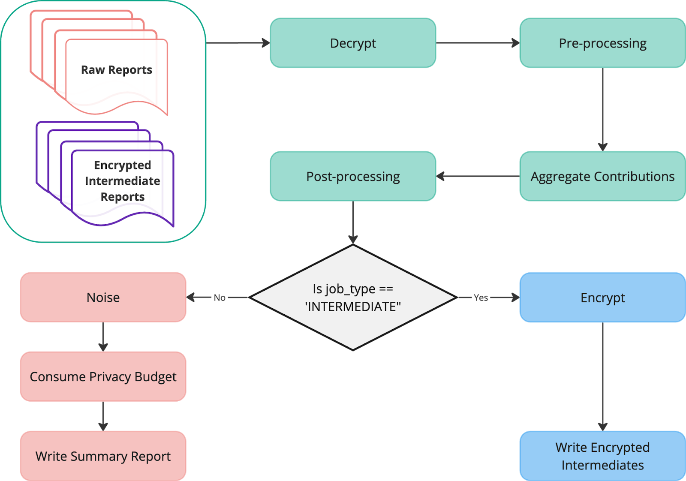
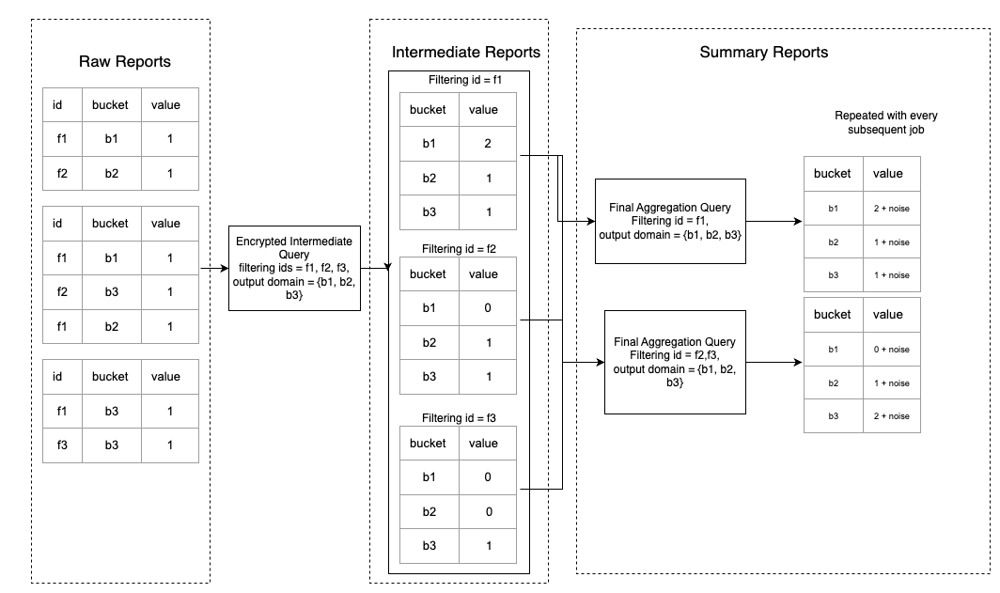

# Encrypted Intermediates

## Table of Contents

-   [Introduction](#introduction)
-   [Terminology](#terminology)
-   [Motivating Use Cases](#motivating-use-cases)
-   [Proposal](#proposal)
    -   [Contribution Filtering](#contribution-filtering)
    -   [Aggregatable Report Accounting](#aggregatable-report-accounting)
    -   [Inputs and Outputs](#inputs-and-outputs)
        -   [Encrypted Intermediates](#encrypted-intermediates)
        -   [Output Location](#output-location)
    -   [Other Considerations](#other-considerations)
        -   [Processing Cost](#processing-cost)
        -   [Aggregatable Report Accounting Failures](#aggregatable-report-accounting-failures)
        -   [Output Domain](#output-domain)
    -   [Sample Query Flow](#sample-query-flow)
    -   [Privacy Considerations](#privacy-considerations)
    -   [Security Considerations](#security-considerations)
-   [Potential Future Changes](#potential-future-changes)

## Introduction

The
[Aggregation Service](https://github.com/WICG/attribution-reporting-api/blob/main/AGGREGATION_SERVICE_TEE.md)
currently processes raw encrypted reports to produce noised aggregated histograms. However, when
adtechs need to repeatedly aggregate the same data, for example, when using
[filtering ID](https://github.com/patcg-individual-drafts/private-aggregation-api/blob/main/flexible_filtering.md)s
or querying across different time ranges with the proposed
[re-querying feature](https://github.com/privacysandbox/aggregation-service/blob/main/explainers/requerying.md),
they could benefit from pre-aggregated intermediate reports. We propose introducing Encrypted
Intermediates. Encrypted Intermediates are reports that store aggregated contributions in an
un-noised but encrypted format, allowing subsequent aggregation queries to reuse these
intermediates. The noise will be added only in the summary report query aggregating these Encrypted
Intermediates. This approach can reduce redundant processing cost by decrypting and aggregating each
raw report only once, leading to faster query performance and lower costs for adtechs.

_Note: This document describes possible new functionality in the Aggregation Service. It is not
necessarily a feature that will ship in the near future, but we are considering it as a largely
backwards-compatible fast-follow. While this new functionality is being developed, we still highly
encourage testing the existing API functionalities to support core utility and compatibility needs._

## Terminology

-   **Job/Query** : A query in Aggregation Service to aggregate the contributions from input
    reports.

-   **Regular/Summary Report Query** : Aggregation Service job that generates noised summary
    reports.

-   **Encrypted Intermediates** : Reports that generated from Encrypted Intermediates query.

-   **Encrypted Intermediates Query** : Aggregation Service job that will generate un-noised
    Encrypted Intermediates.

-   **[Shared ID](https://github.com/WICG/attribution-reporting-api/blob/main/AGGREGATION_SERVICE_TEE.md#disjoint-batches)**:
    Each aggregatable report is associated with a Shared ID. This is the ID against which the budget
    accounting takes place.

-   **[Output Domains](https://developers.google.com/privacy-sandbox/private-advertising/aggregation-service/privacy-protection-report-strategy#pre-declared_aggregation_keys)**
    : These aggregatable keys are given as input to the Aggregation job, and only the aggregation
    output that corresponds to these keys is written in Summary Reports or Encrypted Intermediates.

## Motivating Use Cases

### Contribution Filtering

When using
[filtering IDs](https://github.com/patcg-individual-drafts/private-aggregation-api/blob/main/flexible_filtering.md),
the same reports need to be processed multiple times in separate jobs for each unique ID (except if
the adtech queries all filtering IDs in the same job). This repetition creates significant
processing overhead, especially with a large number of reports. Encrypted Intermediates offer a
solution by allowing a single job to generate multiple Encrypted Intermediates, one for each
filtering ID. This means the original raw reports only get processed once. Future processing then
utilizes the relevant and smaller Encrypted Intermediates, reducing processing cost and time.

### Rolling Window/Extended Range Queries

[Requerying](https://github.com/privacysandbox/aggregation-service/blob/main/explainers/requerying.md)
support in Aggregation Service would allow for reprocessing reports for daily/weekly/monthly queries
and rolling window queries i.e. queries over a sliding time range, like the last 7 days. If adtechs
need to reprocess the reports for every such query, they'd end up aggregating the same set of
records over and over again, creating redundant computation. This becomes especially expensive when
using contribution filtering because the reports undergo additional repeated processing for every
filtering ID. Encrypted Intermediates provides pre-aggregated reports allowing future analyses to
work with these smaller, pre-aggregated reports, reducing processing time and costs.

### Reach measurement

[Reach Measurement](https://github.com/patcg-individual-drafts/private-aggregation-api/blob/main/reach_whitepaper.md)
is a combination of all the above use cases. By utilizing Encrypted Intermediates, we can
[optimize Reach Measurement](https://github.com/patcg-individual-drafts/private-aggregation-api/blob/main/reach_whitepaper.md#sketch-based-methods)
by minimizing redundant processing, reducing latency, and lowering costs.

## Proposal

We propose Aggregation Service to support 2 kinds of queries:

1. The existing regular aggregation query, aka the Summary Report query that does aggregatable
   report accounting,
2. Encrypted Intermediates query producing encrypted un-noised aggregated intermediate reports
   without aggregatable report accounting.

In the
[CreateJobRequest](https://docs.google.com/document/d/1DmPcC_y9P2f-2RUzW7_6_gaoi10hkZe1r3afgdA5hW4/edit?pli=1&tab=t.0#heading=h.mkprtinqk9hi),
the new and optional job parameter "job_type" will serve the purpose of identifying the specific
query type. If not specified, the job type defaults to the existing behavior of generating summary
reports.

```console
{
  "job_request_id": <string>,
  ...
  // Identifies the query type as AGGREGATION producing summary report
  // or INTERMEDIATE producing Encrypted Intermediates.
  // If not set, defaults to AGGREGATION.
  "job_type": <string>,

  "job_parameters": {
   ...
  }
}
```

Both kinds of queries can process raw aggregatable reports and Encrypted Intermediates as inputs.



### Contribution Filtering

One job will produce multiple Encrypted Intermediates corresponding to the filtering Ids queried.
The filtering IDs for the Encrypted Intermediates will be persisted in the shared_info. If there is
no filtering ID specified, then only one Encrypted Intermediate will be produced, corresponding to
the
[default filtering ID of 0](https://github.com/patcg-individual-drafts/private-aggregation-api/blob/main/flexible_filtering.md#backwards-compatibility).

To start with, we plan to write one intermediate report per filtering ID. In the future, we will
consider adding support for combining multiple filtering IDs into a single report.

### Aggregatable Report Accounting

Aggregatable Report Accounting will be done only in the summary report query. To accommodate that,
with every intermediate query, the associated report shared IDs list will be persisted in the
intermediate report's shared_info. Intermediate queries will not consume Aggregatable Report
Accounting Budget. The Aggregation Service will only consume budget in the summary report query and
use the shared IDs corresponding to the queried filtering ID from the Encrypted Intermediates.

With no budget consumption for intermediate queries, Encrypted Intermediates can act as inputs for
subsequent intermediate queries without cost to the budgets, creating a sequential chain of
intermediates. This approach is particularly useful for scenarios involving incremental aggregation.

Even if a report contributes to multiple Encrypted Intermediates, it only contributes to a summary
report in a Summary Report query.

#### Disjointedness of Shared Ids

Even though a report can contribute to multiple Encrypted Intermediates, a single job cannot contain
multiple Encrypted Intermediates that aggregate the same report as it would violate the
"[No Duplicate Rule](https://github.com/WICG/attribution-reporting-api/blob/main/AGGREGATION_SERVICE_TEE.md#no-duplicates-rule)".
If the shared IDs in the input Encrypted Intermediates and the raw reports are not disjoint, the
Aggregation Service will invalidate the job and return an appropriate error.

An implication of this is if a delayed report shares a shared ID with an existing encrypted
intermediate, it can't be appended to that Encrypted Intermediate. To combine the delayed reports
with all the raw reports sharing shared IDs in the same query, an adtech will have to generate a new
Encrypted Intermediate, and discard the existing one generated without the delayed reports.

### Inputs and Outputs

#### Encrypted Intermediates

Each job will output one Encrypted Intermediate for every filtering ID queried. If multiple
filtering IDs are queried, the job will have a corresponding number of Encrypted Intermediates.



The format of Encrypted Intermediates will be similar to raw aggregatable reports: they will have 1)
a visible and unencrypted part i.e. shared_info, and 2) an encrypted payload with aggregated (key,
value) pairs. The Encrypted Intermediates' shared_info will have some additional information
pertinent to Encrypted Intermediates as highlighted below.

**Intermediate Report shared_info**

```jsonc
// Report
{
   "aggregation_service_payloads": [
       {
           "key_id": "<UUID>",
           "payload": "vxia0shX3Kf..."
       }
   ],
   "shared_info": "{\"report_id\":\"<UUID>\",\"earliest_report_time\":\"<TIME INSTANT>\",\"version\":\"0.1\", \"intermediate_id\":\"<UUID>\", \"report_type\":\"intermediate\", \"filtering_ids\":[<FILTERING IDS>],
\"shared_ids\":<encoded shared ids list>, \"api\":<api>
}",
  // The deployment option for the aggregation service.
  "aggregation_coordinator_origin": "https://publickeyservice.msmt.aws.privacysandboxservices.com"
}
```

Highlighted are the relevant fields for Encrypted Intermediates.

-   **report_type** : [New] Identifies the report as an encrypted intermediate. A query processing
    this report would take actions depending on the type.

-   **shared_ids** : [New]. This will include a flattened list of constituent raw reports' shared
    IDs. The query will fail if there are any duplicates in the shared IDs among the processed
    Encrypted Intermediates.

-   **intermediate_id**: [New] A random UUID identifying the Encrypted Intermediates. This is shared
    between all output shards. Aggregation Service will use this ID in combination with the listed
    shared IDs for validating disjointness of shared IDs.

-   **report_id**: A unique UUID for the one shard of Encrypted Intermediates. Each Intermediate
    report is composed of multiple shards. Aggregation Service will use these ids to ensure that the
    same shard is not included multiple times.

-   **version**: Intermediate report's version.

-   **api**: API for the query. Intermediates query will enforce all the input reports to have the
    same API.

-   **earliest_report_time** : [New] The earliest scheduled_report_time of the included input
    reports. It will be the Encrypted Intermediate's report time and will determine its validity.

-   **filtering_ids**: [New] The queried filtering_ids when generating these reports. In subsequent
    queries, intermediate reports will be processed, only if the queried filtering ID is included in
    the intermediate reports. In contrast to aggregating raw reports, where filtering is applied to
    individual contributions, contribution filtering based on filtering IDs is applied to the entire
    intermediate report.

-   **Payload** : Payload would be similar to aggregatable reports except the "id" field, a CBOR map
    encrypted and then base64 encoded.

Note that
[trigger context ID](https://github.com/WICG/attribution-reporting-api/blob/main/AGGREGATE.md#optional-reduce-report-delay-with-trigger-context-id)
and
[context ID](https://github.com/patcg-individual-drafts/private-aggregation-api/blob/main/report_verification.md)
are not included in the Encrypted Intermediates. If it is necessary to determine if a specific
context ID is present in an intermediate report, it must be tracked separately.

#### Output Location

The Encrypted intermediates will be written to sub folders in the specified output location. Each
unique filtering ID will have its own subfolder. This subfolder will be named after the
corresponding filtering ID. Encrypted Intermediates associated with that filtering ID will be
written within that subfolder.

Example:

-   output_location/

    -   18446744073709551615/

        -   ei_1.avro

    -   345/

        -   ei_1.avro

        -   ei_2.avro

### Other Considerations

#### Processing Cost

Generating Encrypted Intermediates involves processing, encryption, latency, and storage costs. Each
ad tech should make its own evaluation of whether using Encrypted Intermediates can lower its total
costs based on their unique circumstances and use case. Some types of queries may benefit from using
Encrypted Intermediates, while others may not, and some could use a combination for different
queries.

#### Aggregatable Report Accounting Failures

Encrypted Intermediates query will not run aggregatable report accounting checks or budget
consumption. So, it is possible to generate Encrypted Intermediates even if the constituent shared
IDs have exhausted their budget. Aggregatable report accounting budget availability check and
consumption will only be performed in the summary report query when producing noised summary
reports. Even if only one of the shared IDs in an Encrypted Intermediate does not have a budget, the
intermediate report, including all its shards, can't be used in the summary report query.

#### Output Domain

Just like summary reports, Encrypted Intermediates will contain aggregations only for the
output_domain specified in job's parameters. The ideal output_domain can vary when working with
Encrypted Intermediates. While a single output_domain might suffice for all Encrypted Intermediate
and summary report queries, sometimes a more nuanced approach can be beneficial. Individual
Encrypted Intermediates might benefit from a smaller, focused output_domain, while the summary
report query might require a larger, combined domain.

Note that the proposal for
[Key Discovery](https://github.com/WICG/attribution-reporting-api/blob/main/aggregate_key_discovery.md)
is currently not compatible with Encrypted Intermediates. Please see the
[Potential Future Changes](#potential-future-changes) Section.

**Choosing Output Domain Keys**: When working with Encrypted Intermediates queries, an adtech should
carefully consider the scope of their output domain. A larger domain captures more data but
increases processing time of the subsequent queries, while a smaller domain reduces latency but may
omit some valuable aggregations. As Encrypted Intermediates jobs are typically run earlier in the
overall processing workflow, the choice of output domain can affect multiple downstream summary
reports. Therefore, an adtech should thoughtfully consider the output domains they provide.

### Sample Query Flow

Here's a made-up scenario: An adtech receives aggregatable reports for two filtering IDs (0 and 1).
The goal is to perform daily aggregations on these reports for each filtering ID.

Let's assume the following for calculations:

-   Raw reports count per hour: 100 million
-   Output domain size: 50 million

Without using Encrypted Intermediates,

-   To obtain daily aggregation, 2 aggregation jobs would be run, each processing 2.4 billion
    reports, resulting in 50 million rows of summary reports per filtering ID.

With Encrypted Intermediates,

The adtech could choose to run 2 Encrypted Intermediates queries at the 12th and 24th hour. All the
raw reports will be processed just once to produce Encrypted Intermediates.

**Hour 12:**

```console
Aggregation(job_type = 'intermediate',
input_location = "raw_reports_location_12_hours",
      filtering_ids = [1,0],
      output_location = "ei_day1_12h_loc",
      output_domain = "50M_output_domain/")
Output: [EI Reports]
               |
               +---> ei_day1_12h_loc/0/ # for filtering ID = 0, 50M rows
               +---> ei_day1_12h_loc/1/ # for filtering ID = 1, 50M rows
```

**Hour 24:**

At the end of 24 hours, results from processing the 12-hour Encrypted Intermediates from the
previous step alongside the remaining raw reports generate an encrypted intermediate consisting of
the daily aggregation unnoised.

```console
Aggregation(job_type = 'intermediate',
input_location = "raw_reports_location_12-24_hours/, ei_day1_12h_loc/",
      filtering_ids = [0,1],
      output_location = "ei_day1_24h_loc",
      output_domain = "50M_output_domain/")
Output: [EI Reports]
               |
               +---> ei_day1_24h_loc/0/ # for filtering ID = 0, 50M rows
               +---> ei_day1_24h_loc/1/ # for filtering ID = 1, 50M rows
```

**Daily Summary Report**

2 jobs for n = [0,1] corresponding to the filtering ids, processing only the relevant Encrypted
Intermediates generate the summary reports per filtering ID.

```console
Aggregation(job_type = 'aggregation',
input_location = "ei_day1_24h_loc/n",
      filtering_ids = n,
      output_location = "summary_report_day1_filteringid_n/",
            output_domain = "50M_output_domain/")
Output: [Noised Summary Reports] #50M rows
```

### Privacy Considerations

#### Unnoised reports will be private

The un-noised Encrypted Intermediates will be made unreadable to adtechs by storing them encrypted.

Furthermore, we prevent unintended information leakage from the size of these encrypted reports by
enforcing fixed output size and fixed length encoding of values in payload.

#### Aggregatable Report Accounting Compliant

With no aggregatable report accounting in intermediate queries, an adtech could create many
Encrypted Intermediates without affecting the budget accounting. For instance, they could create a
new Encrypted Intermediate for including delayed reports intending to use the latest one. However,
even with multiple Encrypted Intermediates from the same raw reports, the raw or encrypted reports
can contribute to summary reports only as long as the
[Aggregation Report Accounting](https://github.com/privacysandbox/aggregation-service/blob/main/docs/batching-strategies.md#aggregatable-report-accounting)
mechanism permits it. We achieve this by recording the aggregable reports' shared IDs in the
encrypted intermediates, and consuming budget for all those shared IDs when processing the encrypted
intermediates.

#### Raw Reports can't be duplicated (No Duplicate Rule)

Shared IDs disjointedness Validation and report ID tracking will prevent the same raw report from
indirectly contributing to the same summary report multiple times through different Encrypted
Intermediates.

#### Persistence of Queried Filtering IDs in Encrypted Intermediates is private

In Encrypted Intermediates the queried filtering IDs will be persisted in the Shared Info. These
persisted IDs will be used in subsequent queries for filtering. These IDs are those provided by the
adtech in the Encrypted Intermediates query, and are already known to them and pose no privacy risk.
It does not reveal any details about the underlying contributions or whether those ids were there in
the original aggregatable report's payload. The ids in the Encrypted Intermediates are purely for
technical functionality and do not disclose any sensitive information.

### Security Considerations

Both raw and Encrypted Intermediates are protected by encryption and can only be decrypted by an
approved Aggregation Service image within the Trusted Execution Environment (TEE).

## Potential Future Changes

-   **Decryption Optimization:**
    1.  The system could potentially reduce decryption overhead by grouping all shared IDs into a
        single shard within a report.
    2.  Investigating alternative encryption mechanisms or exploring the use of symmetric keys
        (instead of HPKE) for encrypting Encrypted Intermediates might yield further performance
        gains.
-   **Optional Output Domain for Encrypted Intermediates**
    1.  To address the challenge that comes with the proposed
        [Key Discovery](https://github.com/WICG/attribution-reporting-api/blob/main/aggregate_key_discovery.md)
        feature where the output domain may not be provided, we have to implement a solution for
        writing the un-noised Encrypted Intermediates in a way that the report metadata does not
        leak information.

**Note:** These are potential future improvements and may require further investigation and
feasibility analysis before implementation.
